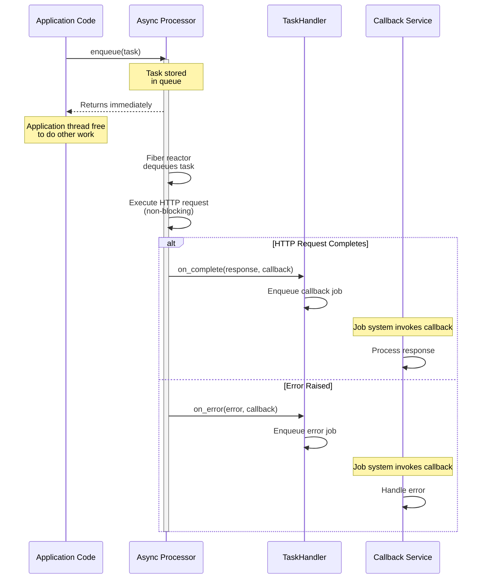
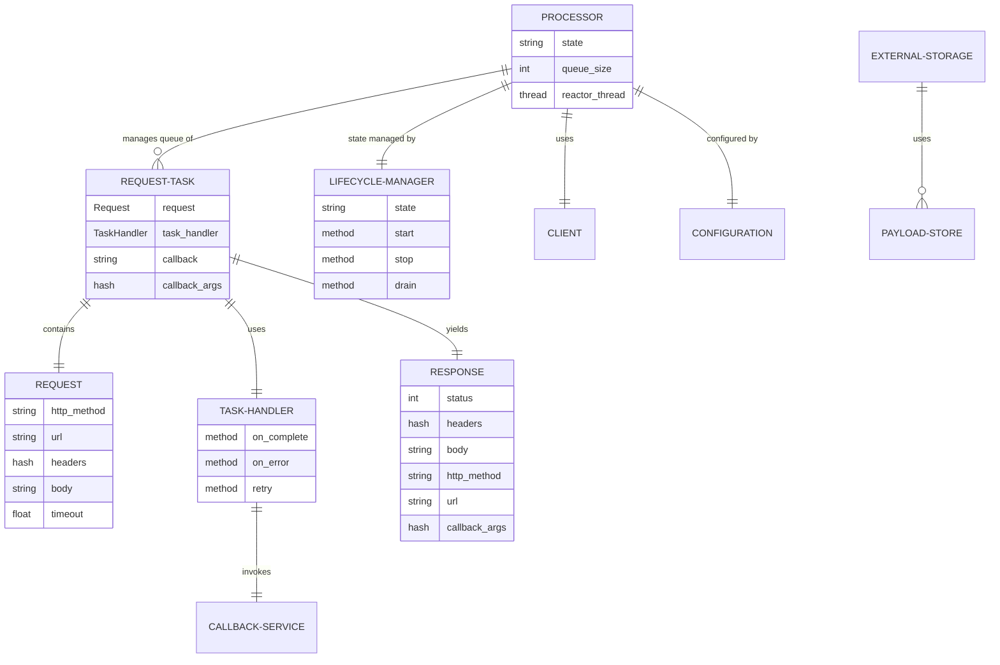

# Architecture

## Overview

PatientHttp provides a mechanism to offload HTTP requests from application threads to a dedicated async I/O processor. The gem uses Ruby's Fiber-based concurrency to handle hundreds of concurrent HTTP requests without blocking application threads.

## Key Design Principles

1. **Non-blocking Threads**: Application threads enqueue HTTP requests and immediately return, freeing them to do other work
2. **Fiber-based Concurrency**: A dedicated processor thread uses the `async` gem to multiplex hundreds of concurrent HTTP connections
3. **Callback Pattern**: HTTP responses are delivered via a pluggable `TaskHandler` that integrates with any job system
4. **Serializable Objects**: Response and error objects are designed to be serialized and passed through job queues

## Core Components

### Processor
The heart of the system - runs in a dedicated thread with its own Fiber reactor. Manages the async HTTP request queue and handles concurrent request execution using the `async` gem.

### TaskHandler
Abstract base class that defines the integration point between the pool and your application. Implementations handle completion callbacks, error callbacks, and job retry operations. Concrete implementations (such as those in the `patient_http-sidekiq` or `patient_http-solid_queue` gems) are responsible for using `Configuration#encryptor` to encrypt serialized `Response`/`Error` data before passing it to the job queue. The base class itself does not call encrypt or decrypt; that responsibility belongs to the implementation. This abstraction allows the pool to work with any job system (Sidekiq, SolidQueue, custom queues, etc.).

### Request/RequestTemplate
`Request` is an immutable value object representing an HTTP request. `RequestTemplate` provides a builder for creating requests with shared configuration (base URL, headers, timeout).

### RequestTask
Wraps a `Request` with execution context: the `TaskHandler`, callback class name, and callback arguments. This is what gets enqueued to the processor.

### Response
Immutable value object representing an HTTP response. Includes status, headers, body, and callback arguments. Designed to be serializable for passing through job queues.

### Error Classes
Typed error classes (`HttpError`, `RequestError`, `RedirectError`) that are also serializable. Include context about the failed request and callback arguments.

### RequestHelper
A mixin module that provides a simplified interface for making async HTTP requests. Allows applications to use the same request interface while swapping out the underlying queueing mechanism. By registering a custom handler, applications can integrate with any job queue system (Sidekiq, Solid Queue, etc.) without changing request-making code. This decouples the request interface from the async processing infrastructure.

### Client/ClientPool
Internal HTTP client that handles connection pooling, HTTP/2 support, and request execution within the Fiber reactor.

### LifecycleManager
Manages processor state transitions (stopped → starting → running → draining → stopping) with thread-safe state machines.

### Encryptor
Handles encryption and decryption of serialized payloads at the job queue boundary. Wraps user-provided encryption/decryption callables (which operate on raw bytes) with JSON serialization and Base64 encoding. Instantiated from `Configuration#encryptor`. The `Encryptor` is a helper: concrete `TaskHandler` implementations are responsible for calling `encryptor.encrypt`/`encryptor.decrypt` at every serialization boundary. Encrypted data is enveloped as `{"__encrypted__" => true, "value" => "<base64>"}` to allow transparent no-op pass-through when no encryption is configured.

### ExternalStorage/PayloadStore
Optional external storage for large request/response payloads. Supports file, Redis, S3, and custom adapters.

## TaskHandler Pattern

The `TaskHandler` abstract class defines how the processor communicates results back to your application:

- **on_complete(response, callback)**: Called when an HTTP request succeeds. Your implementation should enqueue the response for processing (e.g., via a background job).
- **on_error(error, callback)**: Called when an HTTP request fails. Your implementation should enqueue the error for handling.
- **retry**: Called when the processor shuts down with in-flight requests. Your implementation should re-enqueue the original job.

> **Important:** TaskHandler callbacks run on the processor's completion worker threads (see `completion_threads`), not the reactor thread, so they no longer block the event loop. They can still slow the processor down by two routes, so keep them fast -- typically just enqueuing a message for another system to pick up:
>
> - Callbacks compete with the reactor thread for the GVL, so heavy CPU work in a callback can still add latency to in-flight requests.
> - A task stays in the capacity count until its result is delivered, so callbacks that back up consume request capacity and eventually make `enqueue` raise `MaxCapacityError`.
>
> **Callbacks must be thread-safe.** With the default `completion_threads` of 2, results are delivered concurrently, so two callbacks can run at the same time and in an order unrelated to the order the requests completed. Guard any state a handler shares between calls. Set `completion_threads: 1` to serialize delivery on a single worker thread.
>
> **Callbacks must be idempotent.** A failed delivery is retried `completion_retries` times (default 2), and each retry calls the callback again, so a callback that raises after enqueuing its message enqueues it more than once. Set `completion_retries: 0` if the callback cannot be made idempotent.
>
> If a callback keeps raising after the configured retries, the processor sends `completion_failed` to observers and does NOT send `request_end`, so durable tracking survives for external recovery.

Example:
```ruby
class MyTaskHandler < PatientHttp::TaskHandler
  def initialize(job_id)
    @job_id = job_id
  end

  def on_complete(response, callback)
    MyJobSystem.enqueue(callback, :on_complete, response.as_json)
  end

  def on_error(error, callback)
    MyJobSystem.enqueue(callback, :on_error, error.as_json)
  end

  def retry
    MyJobSystem.enqueue_job(@job_id)
  end
end

# Enqueue a request
task = PatientHttp::RequestTask.new(
  request: PatientHttp::Request.new(:get, "https://api.example.com/data"),
  task_handler: MyTaskHandler.new("job-123"),
  callback: "ProcessDataCallback",
  callback_args: {user_id: 123}
)
processor.enqueue(task)
```

## RequestHelper Integration Pattern

The `RequestHelper` module provides an alternative, higher-level API for making async HTTP requests. Instead of manually building `RequestTask` objects and enqueuing them to a processor, you can include the module and use convenience methods.

Key benefits:
- **Interface stability**: Application code making HTTP requests stays the same even when changing job queue systems
- **Reduced boilerplate**: No need to manually construct `Request` and `RequestTask` objects
- **Handler abstraction**: The registered handler encapsulates the processor/job queue integration

Example:
```ruby
# Register a handler once (typically in an initializer)
PatientHttp.register_handler do |request:, callback:, callback_args: nil, raise_error_responses: nil|
  task = PatientHttp::RequestTask.new(
    request: request,
    task_handler: MyTaskHandler.new,
    callback: callback,
    callback_args: callback_args,
    raise_error_responses: raise_error_responses
  )
  processor.enqueue(task)
end

# Use in your application code
class ApiClient
  include PatientHttp::RequestHelper

  request_template(
    base_url: "https://api.example.com",
    headers: {"Authorization" => "Bearer token"},
    timeout: 60
  )

  def fetch_user(user_id)
    async_get(
      "/users/#{user_id}",
      callback: FetchUserCallback,
      callback_args: {user_id: user_id}
    )
  end
end
```

The `RequestHelper` delegates to the registered handler, passing the request details as keyword arguments. The handler translates these into whatever format your job system needs. This allows you to:
- Switch from Sidekiq to Solid Queue without changing `ApiClient`
- Use different queue systems in different environments (inline processing in tests, background jobs in production)
- Test request logic independently of the queue mechanism

## Request Lifecycle



## Component Relationships



## Process Model

Each `Processor` instance runs:
- **One** async HTTP processor (reactor) thread
- **One** fiber reactor within the processor thread
- A small pool of completion worker threads (`completion_threads`, default 2) that decode responses and deliver results

A process usually runs one processor, but `Processor` is fully instance-based: a process can run several named processors (`Processor.new(config, name: :llm)`), each with its own capacity, timeouts, and threads. Requests carry an optional `processor` name (serialized with the request) that integrations use for routing.

```
┌─────────────────────────────────────────────────────────────┐
│                    Application Process                      │
│                                                             │
│  ┌──────────────┐   ┌──────────────┐  ┌──────────────┐      │
│  │ Application  │   │ Application  │  │ Application  │      │
│  │ Thread 1     │   │ Thread 2     │  │ Thread N     │      │
│  └──────┬───────┘   └──────┬───────┘  └──────┬───────┘      │
│         │                  │                 │              │
│         └──────────────────┼─────────────────┘              │
│                            │                                │
│                            ▼                                │
│               ┌─────────────────────────┐                   │
│               │  Async HTTP Processor   │                   │
│               │  (Dedicated Thread)     │                   │
│               │                         │                   │
│               │  ┌───────────────────┐  │                   │
│               │  │  Fiber Reactor    │  │                   │
│               │  │  ═════════════    │  │                   │
│               │  │  100+ concurrent  │  │                   │
│               │  │  HTTP requests    │  │                   │
│               │  └───────────────────┘  │                   │
│               └─────────────────────────┘                   │
└─────────────────────────────────────────────────────────────┘
```

## Concurrency Model

The processor uses Ruby's Fiber scheduler (`async` gem) for non-blocking I/O:

1. **Application threads** remain free while HTTP requests execute
2. **Fiber reactor** multiplexes hundreds of HTTP connections and performs only socket I/O and light bookkeeping
3. **Connection pooling** and HTTP/2 reuse connections efficiently; `max_connections_per_host` bounds sockets per host
4. **Completion worker threads** decode response bodies (join, inflate, charset), build responses, and execute TaskHandler callbacks and `request_end` observers off the reactor. Decoding is CPU-bound and has no fiber yield point, so running it inline on the reactor would stop every other in-flight request until it finished. On a worker thread the Ruby scheduler can preempt it, and Zlib releases the GVL for part of the inflate
5. **Delivery is concurrent, not serialized.** Callbacks and completion-time observers run on any of the `completion_threads` workers, so they must be thread-safe. Completions are also bounded: a task stays in the capacity count until a worker claims its result, so the completion backlog can never exceed `max_connections`

## State Management

The processor maintains state through its lifecycle:

- **stopped**: Initial state, not processing requests
- **starting**: Processor is initializing, reactor thread launching
- **running**: Actively processing requests
- **draining**: Not accepting new requests, completing in-flight
- **stopping**: Shutting down, waiting for requests to finish

## Graceful Shutdown

When the processor is stopped with in-flight requests:

1. The processor stops accepting new requests (drain state)
2. In-flight requests are given time to complete (configurable timeout)
3. Any requests still pending when the timeout expires trigger `TaskHandler#retry`
4. The application's job system can re-enqueue these requests for later processing

## Configuration

All behavior is controlled through a central `Configuration` object:

- Maximum concurrent connections
- Request timeouts
- Connection pool settings
- Retry policies
- Proxy configuration
- Logging
- Payload stores for external storage

## External Storage

For large request/response payloads, the `ExternalStorage` class provides optional external storage:

- **PayloadStore adapters**: File, Redis, S3, ActiveRecord, or custom implementations
- **Automatic threshold**: Payloads exceeding a size limit are stored externally
- **Reference-based**: Stored payloads are replaced with lightweight references
- **On-demand fetch**: Original payloads are fetched when needed

## Thread Safety

- **Thread-safe queues**: `Thread::Queue` for request enqueueing
- **Atomic operations**: `Concurrent::AtomicReference` for state
- **Synchronized access**: Mutexes protect shared data structures
- **Immutable values**: Request/Response are immutable once created

## Further Reading

- [README](README.md)
